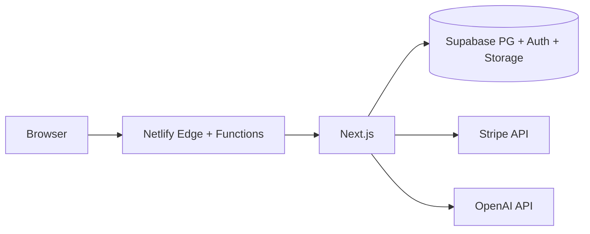

# Design — SanyaStay (三亚旅居通)

## 1. 与商业计划书的映射

| 计划书模块（第八章 / 第十一章） | 本仓库实现 |
|--------------------------------|------------|
| Web Next.js + SSR/SEO | Next.js 16 App Router，`next build --webpack` 兼容 Netlify 与复杂路径 |
| 用户 / 房源 / 订单 / 支付 / 社区 | Supabase SQL：`supabase/migrations/001_initial_schema.sql` + RLS |
| 地图 LBS / VR | 占位：详情页地图区、VR 入口；Mapbox 客户端见 `NEXT_PUBLIC_MAPBOX_TOKEN` |
| 搜索推荐 / ES | MVP：`/api/properties` 用 PostgREST 过滤；Elasticsearch 列为 V1 |
| 微服务 Java/Go | 未采用；MVP 用 Supabase + Next Route Handlers 降低冷启动成本 |

## 2. 运行时架构

## 3. 安全

- **RLS**：各表策略见迁移文件末尾。
- **密钥**：仅服务器路由使用 `STRIPE_SECRET_KEY`、`SUPABASE_SERVICE_ROLE_KEY`（若引入）；浏览器仅用 `NEXT_PUBLIC_*`。
- **中间件**：无 Supabase 环境变量时跳过会话刷新，避免 CI/预览构建硬依赖。

## 4. 部署（Netlify）

- `netlify.toml` 使用 `@netlify/plugin-nextjs`；**不要**手动设置错误的 `publish`（由插件处理）。
- `.npmrc` 固定 `registry.npmjs.org`，避免镜像缺包导致 Tailwind 子包未安装。

## 5. 静态资源

- `public/areas/*.jpg`、`placeholder-property.jpg`：Unsplash 摄影用于演示（见 `public/IMAGES.md`）。
